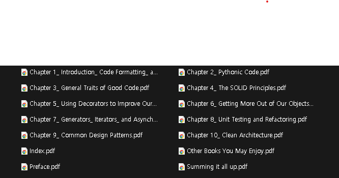

# PDF Chapter Slicer 📚✂️

## What is this?

This is a simple tool that helps you split a big PDF book into smaller PDFs - one for each chapter!

## How it works

1. The program looks at the table of contents in your PDF
2. It figures out which pages belong to each chapter
3. It saves each chapter as its own PDF file

## How to use it

### What you need before starting
- Python installed on your computer
- A PDF file you want to split
- A Claude API key (if you don't have one, the program will ask you to enter information manually)

### Step-by-step guide

1. **Get the program ready**
   - Save the program code as `ChapterSlicer.py`
   - Open your command prompt or terminal
   - Install the needed tools by typing: `pip install pymupdf requests`

2. **Run the program**
   - Type: `python ChapterSlicer.py`
   - The program will start and ask you some questions

3. **Answer the questions**
   - **API Key**: Enter your Claude API key (or just press Enter to skip)
   - **PDF Path**: Type the location of your PDF file (like `C:\Books\MyBook.pdf`)
   - **Output Folder**: Type a name for the folder where your split PDFs will be saved

4. **Wait for the magic to happen!**
   - The program will work to split your PDF into chapters
   - If it can't do it automatically, it will ask you to enter chapter details yourself

5. **Find your split PDFs**
   - When the program is done, check the output folder
   - You'll find one PDF file for each chapter!

## What if something goes wrong?

- If the program can't automatically find the chapters, it will ask you to enter them manually
- Just type the chapter name, start page, and end page when asked
- Press Enter without typing anything when you're done adding chapters

## Example

```
🔑 Claude API Key를 입력하세요: my_api_key_123
📄 PDF 파일 경로를 입력하세요: MyBook.pdf
📂 분리된 PDF를 저장할 폴더명을 입력하세요: SplitChapters
📘 TOC 추출 중...
🔄 Claude API 요청 중...
✅ 챕터별 PDF 저장 완료
```

## Results

Here's what you'll get after running the program:



Each chapter is saved as its own separate PDF file, making it easy to find and read just the parts you need!
